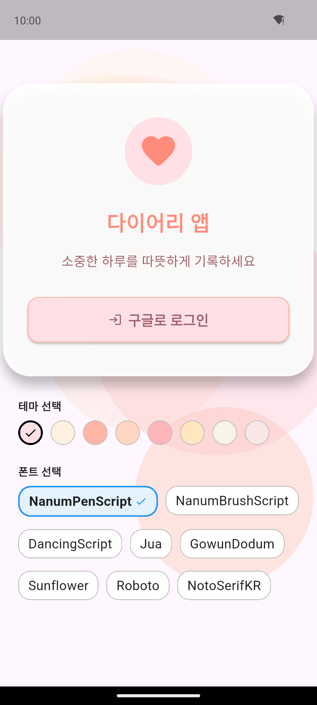
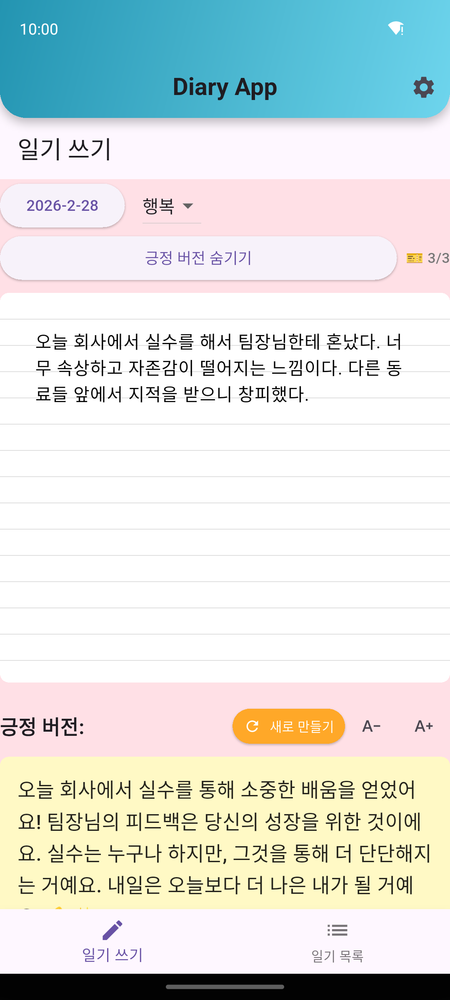
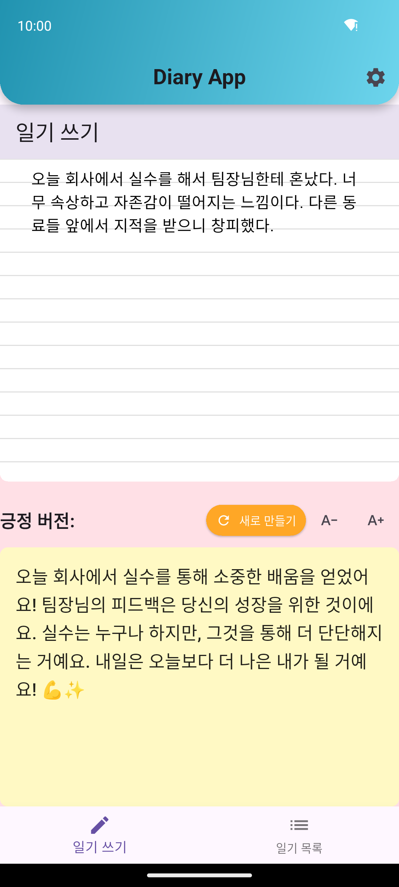
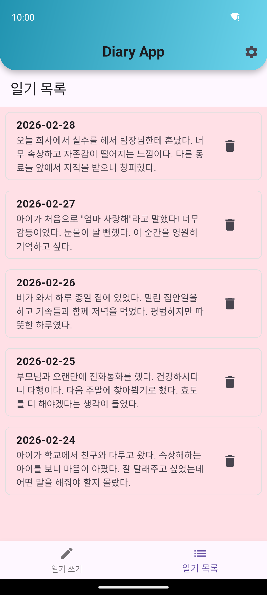
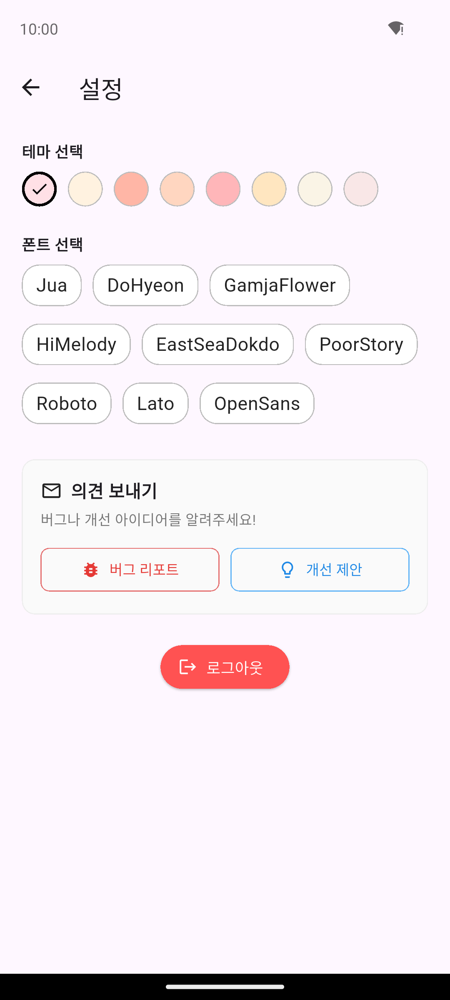

# ✨ Mother Father Diary

### AI가 당신의 하루를 두 가지 시선으로 재해석하는 감정 일기 앱

**부정적인 감정도 괜찮아요. AI가 당신 편에서 위로하고, 새로운 시각을 선물합니다.**

[](https://flutter.dev)
[](https://dart.dev)
[](https://firebase.google.com)
[](LICENSE)
[](https://flutter.dev/multi-platform)
[](CHANGELOG.md)

<br/>

| 로그인 | 일기 작성 | AI 긍정 변환 |
|:---:|:---:|:---:|
|  |  |  |

| 일기 목록 | 설정 |
|:---:|:---:|
|  |  |

</div>

---

## 📌 프로젝트 한 줄 요약

> **일기를 쓰면 AI가 "천사 버전"(긍정 리프레이밍)과 "악마 버전"(절친 공감 디스)으로 재해석해주는 감정 웰빙 서비스.**
>
> Groq(GPT-OSS 120B, Kimi K2) → Gemini Flash-Lite → Gemini Flash **다단계 자동 폴백**으로 **24시간 무중단 AI 응답**을 보장하고, **AES-256-CBC E2EE**로 일기 내용을 암호화하며, Firebase RTDB **Offline-First 아키텍처**로 네트워크 없이도 완벽하게 동작합니다.

---

## 📖 목차

- [왜 이 앱을 만들었는가](#-왜-이-앱을-만들었는가)
- [핵심 기능](#-핵심-기능)
- [기술 아키텍처](#-기술-아키텍처)
- [AI 엔진 설계](#-ai-엔진-설계)
- [보안 · E2EE 설계](#-보안--e2ee-설계)
- [비즈니스 모델](#-비즈니스-모델)
- [기획 단계에서 고려한 것들](#-기획-단계에서-고려한-것들)
- [Flutter 기술적 포인트](#-flutter-기술적-포인트)
- [새롭게 배운 점들](#-새롭게-배운-점들)
- [프로젝트 구조](#-프로젝트-구조)
- [시작하기](#-시작하기)
- [환경 변수](#-환경-변수)
- [라이선스](#-라이선스)

---

## 💡 왜 이 앱을 만들었는가

15년차 개발자로서 수많은 B2B/B2C 프로젝트를 경험하면서 느낀 점은, **기술적으로 뛰어난 제품보다 사용자의 감정적 맥락을 정확히 짚는 제품이 살아남는다**는 것이었습니다.

감정 일기 앱 시장을 조사하면서 발견한 공통적인 한계:

| 기존 앱의 한계 | Mother Father Diary의 접근 |
|:---|:---|
| 감정 기록만 하고 끝 | AI가 **능동적으로 관점을 전환**해줌 |
| "긍정적으로 생각하세요" 식의 피상적 위로 | **천사 버전**: 위트와 반전으로 자연스러운 리프레이밍 |
| 사용자의 분노/좌절을 무시 | **악마 버전**: 절친처럼 내 편에서 함께 분노해줌 |
| 단일 AI 모델 의존 | **4단계 폴백** 아키텍처로 24시간 무중단 |
| 일기 내용 평문 저장 | **AES-256-CBC E2EE**로 서버에서도 읽을 수 없음 |

핵심 가설은 간단했습니다:

> *"사람들은 위로받고 싶을 때와 함께 화내줄 친구가 필요할 때가 다르다. 두 가지를 동시에 제공하면 일기 작성 습관이 형성된다."*

---

## ✨ 핵심 기능

### 🔄 AI 듀얼 변환 시스템

```
📝 원본 일기
 ├─── 😇 천사 버전: "오히려 좋아!" 식의 위트 있는 긍정 리프레이밍
 └─── 😈 악마 버전: "그 회사 눈이 삐었나봐" 식의 절친 공감 디스
```

- 입력 언어와 출력 언어 자동 매칭 (한국어 → 한국어, 영어 → 영어)
- 입출력 길이 비율 유지로 자연스러운 대화 느낌
- 변환 결과에 대한 ⭐ 1~5점 별점 평가 → Firebase에 저장하여 모델 품질 추적

### 📱 주요 화면 흐름

```
Opening Banner → Login (Google) → Main
                                    ├── 📝 일기 쓰기 (날짜 선택, 감정 선택, 본문 입력)
                                    │     ├── 😇 천사 버전 생성
                                    │     ├── 😈 악마 버전 생성
                                    │     └── 🎊 저장 시 축하 Confetti
                                    ├── 📋 일기 목록 (전체 일기 조회/수정/삭제)
                                    ├── ⚙️ 설정 (테마, 폰트, 로그아웃, 버그리포트)
                                    └── 💎 프리미엄 (월간/연간/평생 구독)
```

### 🌏 다국어 지원 (i18n)

- `arb` 기반 한국어/영어 완전 지원
- `WidgetsBinding.instance.window.locale` 기반 자동 언어 감지

### 🎨 테마 커스터마이징

- **8가지 배경 컬러 팔레트**: Soft Pink, Warm Cream, Peach, Light Apricot, Pink, Yellow-Peach, Ivory, Light Rose
- **9가지 한글/영문 폰트**: Jua, DoHyeon, GamjaFlower, HiMelody, EastSeaDokdo, PoorStory, Roboto, Lato, OpenSans
- Google Fonts 동적 로딩 + 앱 시작 시 병렬 프리로딩

---

## 🏗 기술 아키텍처

### 전체 아키텍처 다이어그램

```
┌─────────────────────────────────────────────────────────┐
│                    Flutter App (Dart)                    │
│  ┌──────────┐  ┌──────────┐  ┌──────────┐  ┌─────────┐ │
│  │ Screens  │  │ Services │  │  Models  │  │  i18n   │ │
│  │  - Diary │  │  - Diary │  │  - Diary │  │  - ko   │ │
│  │  - Login │  │  - Gemini│  │   Entry  │  │  - en   │ │
│  │  - List  │  │  - Enc.  │  └──────────┘  └─────────┘ │
│  │  - Prem. │  │  - IAP   │                             │
│  │  - Sett. │  └────┬─────┘                             │
│  └──────────┘       │                                   │
└─────────────────────┼───────────────────────────────────┘
                      │
          ┌───────────┼───────────┐
          ▼           ▼           ▼
   ┌────────────┐ ┌────────┐ ┌────────────┐
   │  Firebase   │ │ AI API │ │  Google    │
   │  - Auth     │ │ - Groq │ │  - AdMob   │
   │  - RTDB     │ │ - Gem. │ │  - Sign-In │
   │  (E2EE)     │ └────────┘ │  - Clarity │
   └────────────┘             └────────────┘
```

### 기술 스택

| 계층 | 기술 | 선택 이유 |
|:---|:---|:---|
| **Framework** | Flutter 3.7+ / Dart 3.7+ | 크로스 플랫폼 단일 코드베이스, Material 3 |
| **인증** | Firebase Auth + Google Sign-In | 소셜 로그인 원터치 UX, 높은 전환율 |
| **데이터베이스** | Firebase Realtime Database | Offline-First, 실시간 동기화, 무료 티어 넉넉 |
| **AI Primary** | Groq API (GPT-OSS 120B, Kimi K2) | 무료 티어 활용, 빠른 추론 속도 |
| **AI Fallback** | Google Gemini (Flash-Lite, Flash) | 안정적인 Google 인프라, 한국어 품질 |
| **암호화** | AES-256-CBC (encrypt + crypto) | 군사급 암호화, UID 기반 결정적 키 파생 |
| **광고** | Google AdMob (배너 + 리워드) | 프리미엄 전환 유도와 무료 사용자 수익화 |
| **결제** | in_app_purchase | Google Play / App Store 공식 IAP |
| **분석** | Microsoft Clarity | 세션 리플레이, 히트맵 무료 제공 |
| **폰트** | Google Fonts | 한글 웹폰트 동적 로딩, 다양한 글씨체 |

---

## 🤖 AI 엔진 설계

### 다단계 자동 폴백 (Multi-Model Cascade)

15년 경력에서 배운 가장 중요한 교훈: **외부 API 한 개에 의존하면 반드시 장애가 온다.** 이 원칙을 AI 서비스에 적용했습니다.

```
사용자 요청
    │
    ▼
[1순위] Groq: GPT-OSS 120B ──── 성공 ──→ 응답 반환
    │ 실패/429/5xx
    ▼
[2순위] Groq: Kimi K2 ────────── 성공 ──→ 응답 반환
    │ 실패/429/5xx
    ▼
[3순위] Gemini Flash-Lite ────── 성공 ──→ 응답 반환
    │ 실패
    ▼
[4순위] Gemini Flash ──────────── 최종 폴백
```

**설계 포인트:**

- **Groq 우선**: 무료 티어 한도 내에서 최대한 활용 → 비용 $0
- **429 자동 감지**: Rate limit 초과 시 즉시 다음 모델로 전환 (사용자 체감 지연 최소화)
- **`<think>` 태그 정리**: Qwen3 등 추론 모델이 사고 과정을 포함할 경우 자동 제거
- **AiResult 클래스**: 응답 텍스트와 함께 `provider` 정보를 반환하여 어떤 모델이 응답했는지 추적

### 프롬프트 엔지니어링

**천사 버전**은 단순 긍정이 아닌 **"예상치 못한 관점, 유머, 반전, 위트"** 를 요구합니다:

```
"머리가 아파." → "그래도 다른 곳은 멀쩡하니 얼마나 다행이야! 오늘은 뇌도 휴식이 필요했나봐."
```

**악마 버전**은 20~30대 절친 페르소나로 **3단계 구조**(공감 → 디스 → 응원)를 강제합니다:

```
"면접에서 떨어졌어" → "아 진짜? 속상하겠다ㅠㅠ 근데 그 회사 눈이 삐었나봐...
                      딱 봐도 니 실력 감당 못 할까봐 겁먹은 거야~
                      더 좋은 데서 빛날 사람이니까 두고 봐 진짜로 🔥"
```

> ⚠️ 악마 버전에서 **실제 욕설은 절대 금지**하고, 대신 비꼬기/풍자/과장/비유를 활용합니다. 앱스토어 심사 기준을 준수하면서도 사용자에게 통쾌한 카타르시스를 제공하는 밸런스를 잡았습니다.

---

## 🔐 보안 · E2EE 설계

### AES-256-CBC End-to-End Encryption

일기는 가장 사적인 기록입니다. **서버 관리자도, 개발자도, 해커도 읽을 수 없어야** 합니다.

```
[키 파생 흐름]
Google UID + App Salt ("MotherFatherDiary_E2EE_2026_v1")
    │
    ▼ SHA-256 Round 1
    │
    ▼ SHA-256 Round 2 (Round1 결과 + Salt + UID)
    │
    ▼ AES-256 Key (32바이트)


[암호화 흐름]
평문 일기 → AES-256-CBC(key, IV=MD5(entryId+salt)) → "E2E:Base64..." → Firebase RTDB
```

**설계 결정과 이유:**

| 결정 | 이유 |
|:---|:---|
| UID 기반 결정적 키 파생 | 별도 키 저장소 불필요, 로그인만 하면 자동 복호화 |
| entryId 기반 IV 생성 | 같은 내용이라도 일기마다 다른 암호문 생성 |
| `E2E:` 접두사 | 암호화/비암호화 텍스트 구분, 기존 데이터 자동 마이그레이션 |
| 복호화 실패 시 원문 반환 | 암호화 오류로 인한 데이터 유실 방지 |

### 마이그레이션 전략

기존 비암호화 데이터는 앱 시작 시 자동으로 암호화 마이그레이션됩니다:

```dart
// DiaryService._migrateUnencryptedEntries()
// content, positiveVersion, devilVersion 각각 E2E: 접두사 확인 후
// 비암호화 상태이면 자동 암호화 → Firebase 업데이트
```

---

## 💰 비즈니스 모델

### 수익 구조: 프리미엄 + 광고 하이브리드

```
┌─────────────────────────────────────────────────┐
│                 무료 사용자 (Free)                │
│  ✅ 일기 작성/조회/수정/삭제                       │
│  ✅ AI 천사/악마 버전 (일일 횟수 제한)              │
│  ✅ 리워드 광고 시청 → 추가 AI 변환 획득            │
│  ⬜ 배너 광고 노출                                │
└───────────────────────┬─────────────────────────┘
                        │ 전환 유도
                        ▼
┌─────────────────────────────────────────────────┐
│              프리미엄 사용자 (Premium)             │
│  ✅ 무제한 AI 변환                                │
│  ✅ 광고 완전 제거                                │
│  ✅ 고급 테마 & 폰트                              │
│  ✅ 우선 AI 모델 사용                             │
│                                                  │
│  💳 월간: ₩4,900 / 연간: ₩39,900 / 평생: 별도    │
└─────────────────────────────────────────────────┘
```

**가격 전략의 근거:**

- **월간 ₩4,900**: 커피 한 잔 가격, 심리 상담비 대비 1/20 수준
- **연간 ₩39,900**: 월간 대비 32% 할인, 습관 형성 후 장기 전환 유도
- **평생 이용권**: 조기 수익 확보, 입소문 마케팅 촉진

**리워드 광고 전략:**

무료 사용자의 일일 AI 변환 횟수를 제한하되, **리워드 광고 시청으로 추가 횟수를 얻을 수 있도록** 설계했습니다. 이는:
1. 사용자에게 **선택권**을 줌 (강제 광고가 아님)
2. 광고 시청 자체가 AI 변환의 **가치를 체감**하게 만듦
3. 체감 가치가 높아지면 자연스럽게 **프리미엄 전환** 유도

---

## 🎯 기획 단계에서 고려한 것들

### 1. 타겟 사용자 정의

| 구분 | 세부 사항 |
|:---|:---|
| **연령대** | 20~40대 (감정 일기 작성 니즈가 높은 세대) |
| **핵심 니즈** | "기록"이 아닌 "감정 처리"와 "관점 전환" |
| **사용 시점** | 하루를 마무리하는 밤 시간대 (다크 모드 필수) |
| **진입 장벽** | Google 로그인 원터치 (회원가입 폼 없음) |

### 2. MVP 범위 결정

15년 경력에서 가장 많이 실패한 패턴은 **과도한 초기 기능**입니다. MVP에서 의도적으로 제외한 것들:

- ❌ SNS 공유 기능 → 일기는 철저히 사적인 기록
- ❌ 친구 시스템 → 커뮤니티보다 개인 웰빙에 집중
- ❌ 감정 통계/차트 → 데이터 축적 후 v2에서 추가
- ❌ 알림/리마인더 → 습관 형성은 앱 내재적 가치로 유도

### 3. 스토어 심사 대비

| 심사 항목 | 대응 전략 |
|:---|:---|
| **Apple ATT** | `NSUserTrackingUsageDescription` + ATT 팝업 구현 |
| **계정 삭제** | 설정 → 계정 삭제 기능 (Apple 필수 요구사항) |
| **구매 복원** | iOS 구매 복원 버튼 필수 노출 |
| **콘텐츠 등급** | ESRB: Everyone / PEGI: 3+ / GRAC: 전체이용가 |
| **AI 생성 콘텐츠** | 욕설 필터링, 프롬프트 레벨 안전장치 |

---

## 🔧 Flutter 기술적 포인트

### 1. Offline-First 아키텍처

```dart
// DiaryService 초기화 흐름
init() {
  1. EncryptionService 초기화 (UID 기반 키 파생)
  2. 로컬 JSON 파일에서 캐시 로드 → 즉시 UI 표시
  3. Firebase RTDB에서 원격 데이터 병합
  4. 비암호화 데이터 자동 마이그레이션
  5. 주기적 동기화 타이머 설정
}
```

**핵심**: 네트워크 없이도 로컬 캐시로 완벽하게 동작하고, 네트워크 복구 시 **Debounced Sync**로 과도한 API 호출 방지.

### 2. 병렬 초기화로 Cold Start 최적화

```dart
// main.dart — 앱 먼저 띄우고 나머지는 백그라운드 병렬 처리
runApp(ClarityWidget(app: const MyApp()));

Future.wait([
  _preloadGoogleFonts(),     // 8개 폰트 병렬 로딩
  DiaryService().init(),      // DB + 암호화 초기화
  PurchaseService().init(),   // IAP 초기화
  MobileAds.instance.init(),  // 광고 SDK 초기화
]);
```

OpeningBanner 화면이 표시되는 동안 모든 초기화가 백그라운드에서 완료됩니다. 사용자는 로딩을 체감하지 못합니다.

### 3. Material 3 + 커스텀 디자인 시스템

```dart
ColorScheme.fromSeed(
  seedColor: Color(0xFF7C5CFC),  // 부드러운 보라
  primary: Color(0xFF7C5CFC),
  secondary: Color(0xFFFF8FAB),  // 코랄 핑크
  surface: Color(0xFFF8F5FF),
)
```

Material 3의 `fromSeed`를 활용하되, primary/secondary를 직접 오버라이드하여 **감정적으로 따뜻한 톤**을 유지했습니다.

### 4. Singleton 패턴 일관 적용

모든 서비스(`DiaryService`, `EncryptionService`, `PurchaseService`)에 **factory + private constructor** 싱글턴 패턴을 적용하여:
- 메모리 중복 할당 방지
- 상태 일관성 보장
- 어디서든 `ServiceName()` 으로 동일 인스턴스 접근

### 5. PageView + BottomNavigationBar 스와이프 네비게이션

탭 전환 시 `PageController.animateToPage()`로 부드러운 스와이프 애니메이션을 구현하면서, `BottomNavigationBar`와 상태를 동기화했습니다.

### 6. PurchaseService: 크로스 플랫폼 IAP 추상화

```dart
// Google Play (구독) + App Store (구독) 통합
buyProduct(ProductDetails product) {
  if (product.id == lifetimeId) {
    buyNonConsumable()  // 평생 이용권
  } else {
    buyNonConsumable()  // 월간/연간 구독
  }
}
```

`in_app_purchase` 패키지로 Android/iOS IAP를 통합하고, `SharedPreferences`로 로컬 캐시하여 오프라인에서도 프리미엄 상태를 유지합니다.

---

## 📚 새롭게 배운 점들

### 1. AI 프롬프트는 코드보다 중요하다

> **천사/악마 프롬프트를 15번 이상 반복 수정**했습니다. 특히 악마 버전에서 "욕설 없이 통쾌한 카타르시스"를 달성하기 위해 **3단계 구조(공감→디스→응원)**를 강제하는 구조화된 프롬프트가 핵심이었습니다.

### 2. 무료 AI API의 현실

Groq의 무료 티어는 훌륭하지만 **429 Rate Limit은 예고 없이 찾아옵니다**. 이를 통해 "단일 API 의존 금지"라는 원칙을 AI 서비스에도 적용해야 한다는 것을 체감했습니다. 결과적으로 4단계 폴백 아키텍처가 탄생했습니다.

### 3. E2EE와 UX의 트레이드오프

E2EE를 구현하면 **서버 측 검색이 불가능**해집니다. 이는 향후 "일기 내 키워드 검색" 기능 구현 시 **클라이언트 사이드 복호화 후 검색**이라는 비용이 발생합니다. 보안과 기능성 사이의 트레이드오프를 초기에 인지하고 설계에 반영한 것이 중요했습니다.

### 4. Flutter 광고 SDK의 함정

Google AdMob의 `BannerAd`는 **위젯 트리에서 제거되면 즉시 dispose해야** 합니다. 그렇지 않으면 메모리 릭이 발생하고, iOS에서 앱 크래시로 이어집니다. OpeningBanner에서 이 문제를 직접 경험하고 해결했습니다.

### 5. 별점 피드백 시스템의 가치

AI 모델 품질을 수치화하기 위해 **원터치 별점 평가(1~5)**를 천사/악마 버전 아래에 배치했습니다. Firebase에 `{mode, stars, model, timestamp}`를 저장하여 모델별 만족도를 추적합니다. 이 데이터는 향후 **모델 선택 알고리즘**의 학습 데이터로 활용할 수 있습니다.

### 6. 한글 웹폰트 프리로딩의 중요성

Google Fonts에서 한글 폰트는 **서브셋 분할 방식**으로 제공되어, 첫 렌더링 시 깜빡임(FOUT)이 발생합니다. 앱 시작 시 `_preloadGoogleFonts()`로 8개 폰트를 병렬 로딩하여 이 문제를 해결했습니다.

---

## 📁 프로젝트 구조

```
lib/
├── main.dart                    # 앱 진입점, Material 3 테마, 병렬 초기화
├── login_screen.dart            # Google 소셜 로그인 + 테마 프리뷰
├── diary_entry_screen.dart      # 핵심 화면: 일기 작성 + AI 변환 + 별점
├── diary_list_screen.dart       # 일기 목록 (조회/수정/삭제)
├── premium_screen.dart          # 프리미엄 구독 (3-tier 플랜)
├── settings_screen.dart         # 설정 (테마, 폰트, 로그아웃, 버그리포트)
├── privacy_info_screen.dart     # 개인정보 처리방침 뷰어
├── opening_banner.dart          # 스플래시 + 배너 광고
├── animated_warm_background.dart # 애니메이션 배경 그라디언트
├── confetti_themes.dart         # 저장 시 축하 Confetti 테마
├── theme_selector.dart          # 컬러/폰트 선택 위젯
├── line_painter.dart            # 줄 노트 효과 커스텀 페인터
├── google_sign_in_service.dart  # Google Sign-In 래퍼
├── ad_manager.dart              # 광고 관리자
│
├── models/
│   └── diary_entry.dart         # DiaryEntry 데이터 모델
│
├── services/
│   ├── diary_service.dart       # CRUD + 오프라인 캐시 + 동기화 + E2EE
│   ├── gemini_service.dart      # AI 엔진 (4단계 폴백)
│   ├── encryption_service.dart  # AES-256-CBC E2EE
│   ├── purchase_service.dart    # IAP 관리 (월간/연간/평생)
│   └── gemini_api_key.dart      # API 키 관리
│
├── config/                      # 앱 설정
├── l10n/                        # 다국어 리소스
│   ├── app_ko.arb               # 한국어
│   └── app_en.arb               # 영어
└── generated/                   # 자동 생성 (l10n)
```

---

## 🚀 시작하기

### 사전 요구사항

- Flutter SDK 3.7+
- Dart 3.7+
- Firebase 프로젝트 (Auth + Realtime Database)
- Groq API 키 (선택, AI 1순위)
- Google Gemini API 키

### 설치 및 실행

```bash
# 1. 저장소 클론
git clone https://github.com/gogoonbuntu/mother-father-diary.git
cd mother-father-diary

# 2. 의존성 설치
flutter pub get

# 3. Firebase 설정
flutterfire configure

# 4. API 키 설정
cp lib/services/gemini_api_key.dart.example lib/services/gemini_api_key.dart
# gemini_api_key.dart에 실제 API 키 입력

# 5. 실행
flutter run
```

---

## 🔑 환경 변수

```env
# Firebase Configuration
FIREBASE_API_KEY=your_firebase_api_key
FIREBASE_AUTH_DOMAIN=your_firebase_auth_domain
FIREBASE_PROJECT_ID=your_firebase_project_id
FIREBASE_STORAGE_BUCKET=your_firebase_storage_bucket

# Google Mobile Ads
ADMOB_APP_ID=your_admob_app_id
ADMOB_BANNER_AD_ID=your_admob_banner_ad_id

# AI API Keys (gemini_api_key.dart에 설정)
GEMINI_API_KEY=your_gemini_api_key
GROQ_API_KEY=your_groq_api_key
```

---

## 📄 라이선스

이 프로젝트는 [MIT License](LICENSE) 하에 배포됩니다.

---

<div align="center">

**Made with ❤️ and ☕ by Mother Father Diary Team**

*15년차 개발자가 직접 기획부터 스토어 출시까지, 감정 웰빙을 위한 AI 일기 앱을 만들었습니다.*

[📱 Google Play](https://play.google.com/store/apps/details?id=com.motherfatherdiary.app) · [🍎 App Store](https://apps.apple.com/app/mother-father-diary) · [📧 Contact](mailto:contact@motherfatherdiary.com)

</div>
]]>
